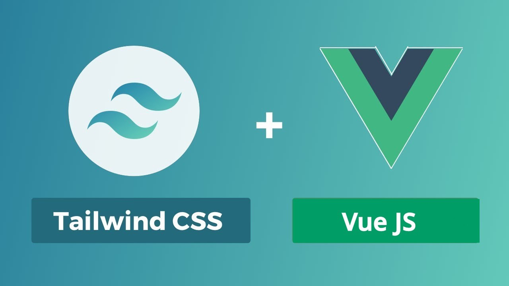
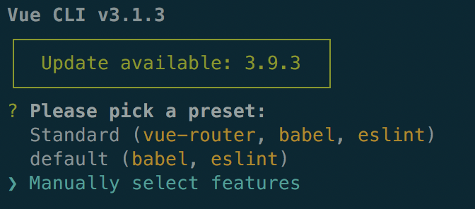
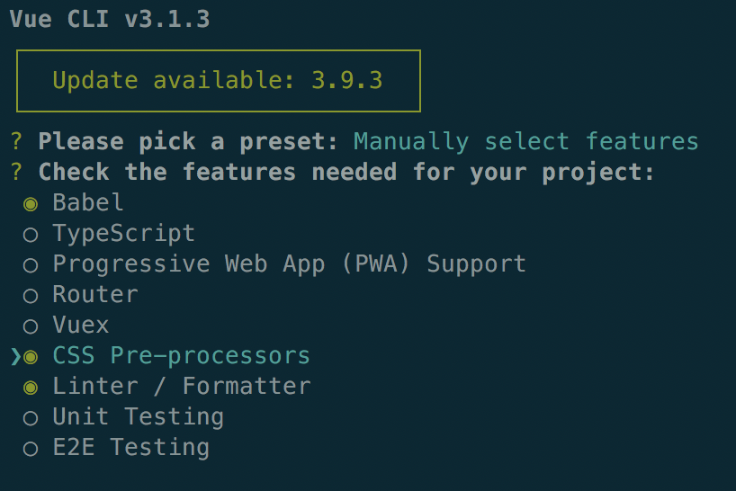

# Vue & Tailwind


Ce workshop personel a pour but , dans un premier temps, d'intégrer Tailwind dans un projet Vue afin de tirer le meilleur des deux. Par la suite je prévois la possibilité de personnaliser ses thèmes Tailwind et encore plus tard intégrer Laravel pour le Back-End.

Mais revenons-en à nos moutons et concentrons-nous sur Front-End ;)

### Vue JS

Il s'agit d'un framework Javascript. Jusqu'ici je pense que tout le monde suit. Mais nous n'allons pas trop nous attarder sur les détails de ce framework.

Si vous voulez de la bonne documentation, quoi de mieux que le site de <a href="https://fr.vuejs.org/index.html">Vue</a>!

Et pour ceux qui ne se sont pas encore familiariser avec Vue, voici le <a href="https://github.com/jeandavidwuilquot/VueJS-workshop">workshop</a> d'un ancien BeCodien qui explique les bases de ce framework en utilisant le CDN (Content Delivery Network). Allez-y! Et revenez quand vous serez prêts.

Pour les autres, on passe à la suite.

Ici nous n'allons pas utiliser de CDN mais passer par le CLI (Command Line Interface). Mais ne vous inquiétez pas tout se passera bien.

#### Configurer et créer un projet Vue
Tout d'abord on va installer le package de Vue afin d'utiliser les commandes requises (Ceci dit avec le workshop donné plus haut ça devrait déjà être fait!). Ouvrez un terminal et tapez:
```
$ npm install -g @vue/cli
```
Maintenant, toujours avec le terminal, allez où vous voulez pour créer votre premmier projet qu'on va appeler my-app (vive l'originalité) et tapez:
```
$ vue create my-app
```
Vous allez avoir un choix qui va s'afficher dans le terminal. Si vous ne voulez pas utiliser Tailwind alors appuyez sur la touche Enter et votre projet sera créé.
Mais nous, nous allons choisir ***Manually select features***, pour choisir nous-même ce qu'on voudra avec notre projet Vue.



Et puis à nous de choisir les features nécessaires. Ici pour ne pas se prendre la tête nous allons laisser ***Babel*** et ***Linter / Formatter*** cochés. Mais nous allons sélectionner ***CSS Pre-processors*** avec la barre d'espace. Puis la toucher Enter pour confirmer nos choix.



Ensuite, nous allons séletionner les prochianes options comme ceci:
* Sélectionner ***Sass/SCSS (with dart-sass)***
* Laisser coché ***ESLint with error prevention only***
* Laisser coché aussi ***Lint on save***
* Choisir ***In dedicated config files***

À la fin on vous demandera si vous voulez enregistré ce preset, pratique pour recréer des projets Vue avec les mêmes paramètres.

Une fois tout ça fait, notre projet Vue est prêt!

### TailwindCSS

Qu'est-ce donc que cette chose là? Il s'agit d'un framework CSS qui permet énormément de créer ses designs, le tout sans toucher une ligne de CSS (voir très peu).
Les aficionados de Bootstrap s'y retrouveront assez vite, mais pour les plus curieux, voici le <a href="https://tailwindcss.com/">site</a>.

Ici notre but ultime, si vous ne l'avez pas compris, c'est de faire un projet Vue **SANS TOUCHER UNE LIGNE DE CSS**. Ce qui pourrait paraître fou pour certains, mais vous allez voir, la magie va opérer ;)

#### Installation et configuration

Comme pour Vue, ouvrez à nouveau votre terminal, ou bien revenez-y. Mais vous devrez revenir à la racine du projet créé précédemment. Puis mettez cette ligne de commande:
```
$ npm install tailwindcss
```
Ensuite, toujours à la racine du projet, allez dans ***src/assets/*** et créez un dossier ***CSS*** ou bien ***SCSS*** (au choix selon votre affinité). Et dedans, créez un fichier ***tailwind.css*** (ou ***.scss***).

Dans le fichier créé, copiez ceci:
```css
@tailwind base;
@tailwind components;
@tailwind utilities;
```
Et dans le fichier **main.js** qui est dans le dossier **src/**, collez cette ligne afin d'importer le fichier créé plus haut (évidemment pensez à ne pas vous tromper pour le type de fichier):
```javascript
import '@/assets/css/tailwind.css'
```
Et voilà, Tailwind est installé. Mais ce n'est pas tout!

### PostCSS

PostCSS est un outil de transformation CSS avec Javascript. Ne me regardez pas comme ça, j'ai juste repris la première ligne qu'on lit lorsqu'on arrive sur le <a href="https://postcss.org/">site en question</a>.
Cet outil optimise énormément le CSS de vos projets, vous l'aurez compris je pense. Donc ici nous allons y intégrer Tailwind afin de bien oprimiser tout ça.

À la racine du projet, dans le fichier ***postcss.config.js*** on va mettre 2 plugins afin d'intégrer Tailwind et un autoprefixer:
```javascript
module.exports = {
    plugins: [
        require('tailwind'),
        require('autoprefixer'),
    ]
}
```
Fini!!!

Maintenant à vous de jouer et de (re)découvrir **Vue.JS**.
